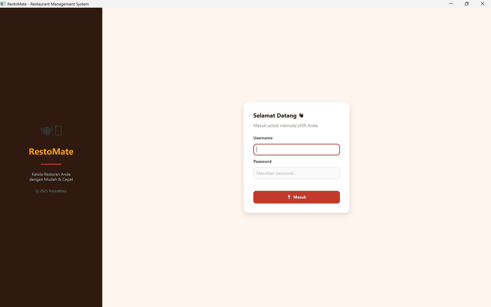
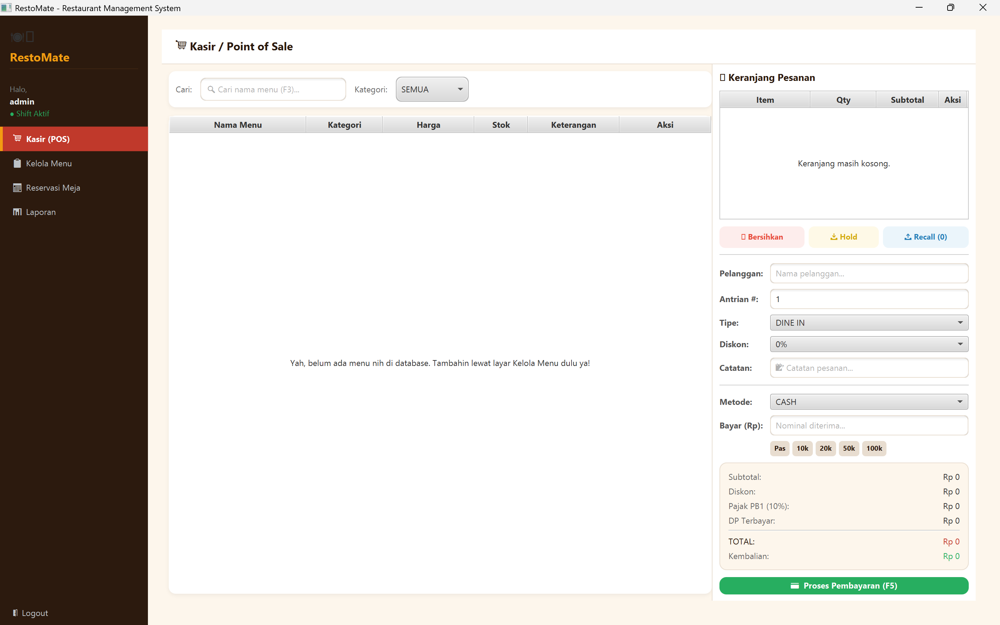
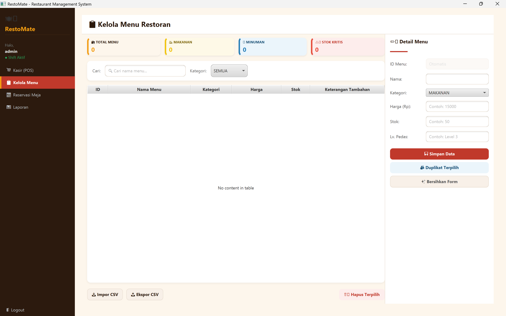
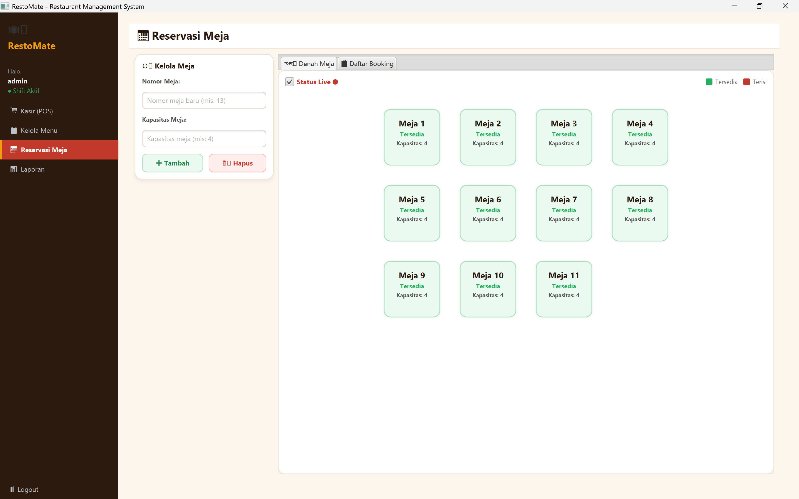
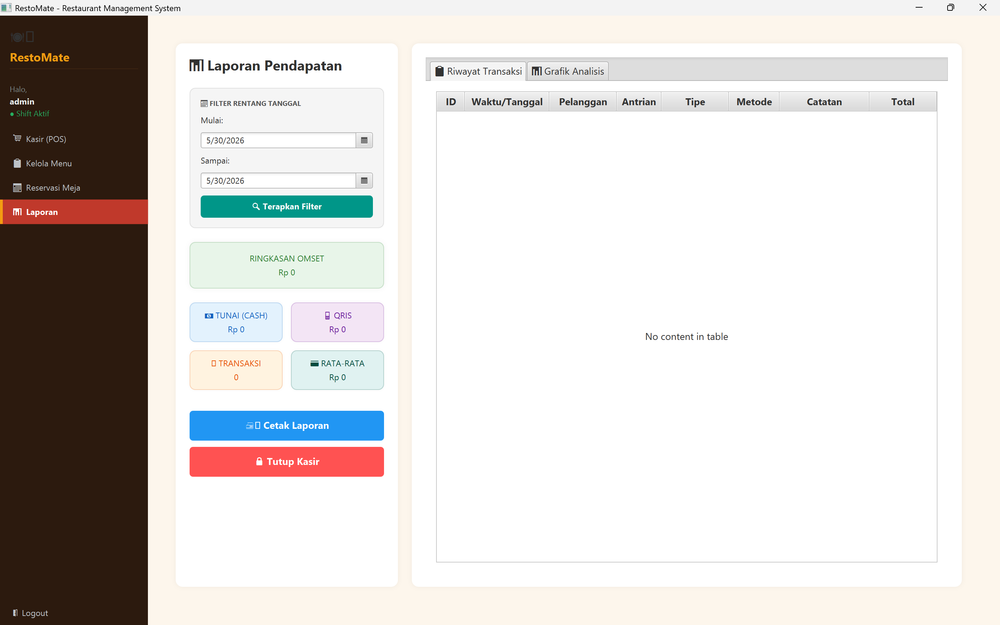

# 🍽️ RestoMate - Restaurant Management System

[](https://openjdk.org/)
[](https://openjfx.io/)
[](https://www.sqlite.org/)
[](https://gradle.org/)

**RestoMate** adalah aplikasi desktop modern berbasis JavaFX yang dirancang khusus untuk menyederhanakan dan mengoptimalkan operasional manajemen restoran secara menyeluruh. Aplikasi ini mengintegrasikan modul kasir (Point of Sale), pengelolaan menu makanan & minuman, manajemen reservasi meja, serta sistem pelaporan keuangan real-time ke dalam satu platform yang intuitif dan mudah digunakan.

---

## ✨ Fitur Utama

Aplikasi RestoMate dilengkapi dengan berbagai modul fitur canggih yang terintegrasi:

1. **🔐 Sistem Otentikasi & Keamanan (Login)**
   - Proteksi akses akun bagi admin dan staff.
   - Enkripsi password menggunakan algoritma **SHA-256** untuk menjamin keamanan data pengguna.
   - Pembuatan akun administrator default secara otomatis saat database pertama kali diinisialisasi.

2. **💻 Kasir / Point of Sale (POS)**
   - Manajemen pesanan dinamis yang mendukung tipe pemesanan **Dine In** (Makan di Tempat) dan **Take Away** (Bawa Pulang).
   - Pencatatan detail pesanan lengkap dengan nama pelanggan, nomor antrian, serta catatan kustom.
   - Validasi ketersediaan stok menu secara real-time saat transaksi berlangsung.
   - Mendukung berbagai metode pembayaran (Cash, Card, QRIS, dll.).
   - Penyimpanan struk transaksi otomatis dalam bentuk file teks terstruktur di direktori lokal (`receipts/`).

3. **📋 Pengelolaan Menu (Food & Beverage Management)**
   - Manajemen katalog menu makanan (dengan indikator tingkat kepedasan) dan minuman (opsi dingin/panas).
   - Operasi CRUD (Create, Read, Update, Delete) lengkap untuk manajemen harga dan stok item menu.
   - Integrasi file gambar menu untuk mempermudah visualisasi item.

4. **📅 Manajemen Reservasi Meja**
   - Pemesanan meja (Meja 1-12) lengkap dengan pencatatan kapasitas dan jumlah tamu.
   - Pencatatan uang muka (Down Payment / DP) serta estimasi waktu penyajian makanan.
   - Fitur pemesanan menu di awal (Pre-order Menu) yang terintegrasi langsung saat melakukan reservasi.
   - Indikator status reservasi yang diperbarui secara dinamis (AKTIF, SELESAI, BATAL).

5. **📊 Laporan & Analitik Keuangan**
   - Ringkasan statistik keuangan yang mencakup total omset, pendapatan tunai, pendapatan QRIS, rata-rata nilai transaksi (AOV), dan jumlah transaksi.
   - Grafik interaktif untuk visualisasi tren pendapatan harian dan proporsi metode pembayaran.
   - Filter data transaksi berdasarkan rentang tanggal.

---

## 🛠️ Teknologi yang Digunakan

| Pustaka / Dependensi | Versi | Deskripsi / Kegunaan |
| :--- | :--- | :--- |
| **Java SDK** | 21 | Bahasa pemrograman utama aplikasi |
| **JavaFX** | 21 | Framework UI desktop yang responsif dan modern |
| **Gradle** | 8.x | Build tool dan manajemen dependensi proyek |
| **SQLite JDBC** | 3.45.2.0 | Driver database lokal SQLite yang ringan dan cepat |
| **SLF4J Simple** | 2.0.12 | Library pencatatan log (logging) aplikasi |

---

## 📂 Struktur Proyek

Proyek ini mengadopsi pola arsitektur **MVC (Model-View-Controller)** yang dipadukan dengan **DAO (Data Access Object)** untuk menjaga pemisahan modul logika bisnis, tampilan pengguna, dan akses database tetap bersih:

```text
RestoMate/
├── receipts/                 # Folder penyimpanan struk transaksi (.txt)
├── src/
│   └── main/
│       └── java/
│           └── com/
│               └── restomate/
│                   ├── Main.java          # Entry point aplikasi JavaFX
│                   ├── controllers/       # Logika pengontrol UI (Controller)
│                   │   ├── CashierController.java
│                   │   ├── LoginController.java
│                   │   ├── ManageMenuController.java
│                   │   ├── ReportController.java
│                   │   └── ReservationController.java
│                   ├── dao/               # Objek Akses Data (DAO)
│                   │   ├── MenuDAO.java
│                   │   ├── ReservationDAO.java
│                   │   ├── TableDAO.java
│                   │   ├── TransactionDAO.java
│                   │   └── UserDAO.java
│                   ├── models/            # Representasi data bisnis (Model)
│                   │   ├── Makanan.java
│                   │   ├── MenuRestoran.java
│                   │   ├── Minuman.java
│                   │   ├── Reservation.java
│                   │   ├── RestaurantTable.java
│                   │   ├── Transaction.java
│                   │   ├── TransactionItem.java
│                   │   └── User.java
│                   ├── utils/             # Helper utilitas database
│                   │   └── Database.java
│                   └── views/             # Komponen antarmuka pengguna JavaFX (View)
│                       ├── CashierView.java
│                       ├── DashboardView.java
│                       ├── LoginView.java
│                       ├── ManageMenuView.java
│                       ├── ReportView.java
│                       └── ReservationView.java
├── build.gradle              # Konfigurasi Gradle build script
├── gradlew.bat               # Executable script Gradle (Windows)
└── restaurant.db             # File database SQLite lokal (terbuat otomatis)
```

---

## 🚀 Panduan Instalasi & Menjalankan Aplikasi

### Persyaratan Sistem
Sebelum memulai, pastikan perangkat Anda telah memenuhi spesifikasi berikut:
- **Java Development Kit (JDK)** versi **21** atau yang lebih baru.
- Koneksi internet (diperlukan untuk mengunduh dependensi Gradle pada build pertama).

### Langkah-langkah Menjalankan Aplikasi
1. **Clone Repositori**
   ```bash
   git clone https://github.com/MochPutraFS/RestoMate.git
   cd RestoMate
   ```

2. **Inisialisasi Database**
   Database lokal SQLite (`restaurant.db`) akan otomatis terbuat di direktori root saat aplikasi dijalankan untuk pertama kalinya. Tidak perlu konfigurasi server database terpisah.

3. **Jalankan Aplikasi**
   - **Melalui Terminal (Windows):**
     ```bash
     .\gradlew.bat run
     ```
   - **Melalui Terminal (Linux/macOS):**
     ```bash
     chmod +x gradlew
     ./gradlew run
     ```
   - **Melalui IDE (VS Code / IntelliJ IDEA):**
     Buka proyek ini di IDE Anda, biarkan sinkronisasi Gradle selesai, lalu jalankan kelas `com.restomate.Main`.

---

## 📖 Panduan Penggunaan

### 1. Login Pertama Kali
Saat aplikasi dijalankan, Anda akan diarahkan ke halaman login. Gunakan kredensial administrator default berikut:
- **Username:** `admin`
- **Password:** `admin`


*Gambar 1: Tampilan Halaman Login RestoMate*

---

### 2. Halaman Utama & Layanan Kasir (POS)
Setelah berhasil login, Anda langsung masuk ke halaman utama yang menampilkan modul Kasir (POS) serta sidebar navigasi untuk beralih ke modul lainnya.

Pilih menu yang dipesan pelanggan, masukkan kuantitas (QTY), tentukan tipe pesanan, pilih metode pembayaran, dan klik selesaikan transaksi untuk mencetak struk belanja.


*Gambar 2: Tampilan Menu Kasir (Point of Sale)*

---

### 3. Pengelolaan Menu Makanan & Minuman
Modul ini digunakan untuk melakukan manajemen inventaris menu, seperti menambah menu baru, memperbarui harga, mengelola stok, serta mengatur klasifikasi item.


*Gambar 3: Tampilan Pengelolaan Menu Makanan & Minuman*

---

### 4. Manajemen Reservasi Meja
Gunakan modul ini untuk mencatatkan data reservasi meja restoran, memasukkan jumlah tamu, mengelola pembayaran DP (Down Payment), serta memesan item menu di awal (Pre-order).


*Gambar 4: Tampilan Manajemen Reservasi Meja*

---

### 5. Laporan Keuangan
Modul Laporan menampilkan statistik penjualan real-time beserta grafik tren pendapatan harian untuk membantu memonitor performa restoran secara komparatif.


*Gambar 5: Tampilan Laporan Penjualan & Grafik Analitik*

---

## 👥 Kontributor

### Pengembang Utama (Developers)
* **[Moch. Putra Firmansyah Sultan](https://github.com/MochPutraFS)**
* **[Achmad Tifli](https://github.com/achmadtifli-web)**
* **[Aliyah Fitraturramadhani](https://github.com/aliyahfitraturramadhani-hash)**

### Kontributor Tambahan (Special Thanks)
* **[Meisyah Maharani Putri](https://www.instagram.com/thyyself_?igsh=MTQxMml3cWJrbWE5cA==)** - *Kontributor Ide Fitur*

---

## 📄 Lisensi

Proyek ini dilisensikan di bawah **MIT License** - lihat file [LICENSE](LICENSE) untuk detail lebih lanjut.

